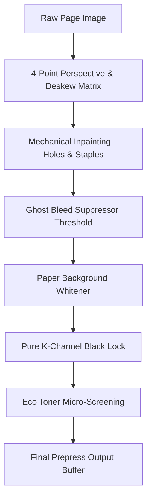

# PrintVLC — Deep Technical Architecture

Created and maintained by **[DaiviAeroBoy](https://github.com/DaiviAeroBoy)**.  
Repository: **[DaiviAeroBoy/PrintVLC](https://github.com/DaiviAeroBoy/PrintVLC)**.

This document details the engineering specifications, mathematical algorithms, memory lifecycles, and client-side demuxing pipelines powering **PrintVLC** (*The Universal "VLC Media Player" of Printing*).

---

## 📑 Table of Contents
1. [Architectural Philosophy](#1-architectural-philosophy)
2. [Universal Demuxing & Ingestion Engine](#2-universal-demuxing--ingestion-engine)
3. [Imposition Mathematics & Geometry Algorithms](#3-imposition-mathematics--geometry-algorithms)
   - [3.1 Saddle-Stitch Signature Formulation](#31-saddle-stitch-signature-formulation)
   - [3.2 GSM-Based Creep Compensation (Paper Shingling)](#32-gsm-based-creep-compensation-paper-shingling)
   - [3.3 Poster Tiling Matrix Formulation](#33-poster-tiling-matrix-formulation)
   - [3.4 N-Up Layout Grid Mathematics](#34-n-up-layout-grid-mathematics)
4. [Prepress Pixel Processing & Ink Intelligence Pipeline](#4-prepress-pixel-processing--ink-intelligence-pipeline)
   - [4.1 Pure K-Channel Black Lock](#41-pure-k-channel-black-lock)
   - [4.2 Eco Toner Micro-Screening Filter](#42-eco-toner-micro-screening-filter)
   - [4.3 Scanner Background Whitening & Ghost Bleed Suppression](#43-scanner-background-whitening--ghost-bleed-suppression)
   - [4.4 CMYK Density & Real-Time Cost Estimation](#44-cmyk-density--real-time-cost-estimation)
5. [Memory Isolation, Security & Ephemeral Lifecycle](#5-memory-isolation-security--ephemeral-lifecycle)
6. [On-Device Neural Engine (WebGPU Acceleration)](#6-on-device-neural-engine-webgpu-acceleration)
7. [Single-File Self-Contained Inliner Pipeline](#7-single-file-self-contained-inliner-pipeline)

---

## 1. Architectural Philosophy

Traditional desktop publishing (DTP) software and operating system printer drivers rely on heavy, platform-specific binaries, kernel-level drivers, and increasingly, intrusive cloud telemetry services.

PrintVLC adopts the architectural paradigm popularized by **VLC Media Player**:
- **Demux Any Format:** Parse, decode, and normalize raw binary streams in userland memory without external dependencies.
- **Client-Side RAM Execution:** Zero document bytes ever leave the browser sandbox. No telemetry, no cloud conversion servers.
- **Hardware-Agnostic Output:** Direct communication with devices via standard web hardware APIs (`navigator.usb`, `navigator.bluetooth`, local network IPP/Raw sockets) or the zero-bleed `@media print` system spooler.

```
                      ┌─────────────────────────────────┐
                      │    Input File / Stream Drop     │
                      │  (PDF, DOCX, XLSX, DXF, ZPL...) │
                      └────────────────┬────────────────┘
                                       │
                                       ▼
                      ┌─────────────────────────────────┐
                      │    Universal Document Hopper    │
                      │   (WASM & Client-Side Codecs)   │
                      └────────────────┬────────────────┘
                                       │
                                       ▼
                      ┌─────────────────────────────────┐
                      │  High-DPI Unified Queue (Page[])│
                      │      (2D Canvas Buffers)        │
                      └────────────────┬────────────────┘
                                       │
        ┌──────────────────────────────┼──────────────────────────────┐
        ▼                              ▼                              ▼
┌──────────────┐               ┌──────────────┐               ┌──────────────┐
│  Imposition  │               │   Prepress   │               │ On-Device AI │
│  Transforms  │               │ Pixel Filters│               │  Assistant   │
│(Booklet/Grid)│               │ (Pure K/Eco) │               │   (WebGPU)   │
└───────┬──────┘               └───────┬──────┘               └───────┬──────┘
        │                              │                              │
        └──────────────────────────────┼──────────────────────────────┘
                                       │
                                       ▼
                      ┌─────────────────────────────────┐
                      │   Hardware Dispatch & Spooler   │
                      │ (WebUSB, BLE, IPP, PDF-Lib X-1a)│
                      └─────────────────────────────────┘
```

---

## 2. Universal Demuxing & Ingestion Engine

The **Universal Document Hopper** (`src/utils/documentHopper.ts`) abstracts disparate file formats into a standardized, paginated `PageItem` model:

```typescript
export interface PageItem {
  id: string;
  pageNumber: number;
  sourceFileName: string;
  sourceFileType: string;
  widthPt: number;             // Standard 72 pt per inch
  heightPt: number;
  rotation: number;            // 0, 90, 180, 270 degrees
  canvasPreviewUrl?: string;   // High-res Object URL
  renderedBlob?: Blob;
  originalData?: ArrayBuffer | string;
  isCustomBlank?: boolean;
}
```

### Specific Decoder Implementations:

| File Type | Decoder Library | Ingestion Methodology |
| :--- | :--- | :--- |
| **PDF** | `pdfjs-dist` | Rasterizes vector streams directly onto an offscreen canvas at $2.0\times$ scale (150–300 DPI equivalent), recording memory handles in ephemeral storage. |
| **DOCX** | `docx-preview` | Renders in a detached headless virtual DOM element. Extracts paragraphs, tables, images, and fonts, mapping them onto a calibrated A4/Letter canvas sheet. |
| **Spreadsheets** | `xlsx` (SheetJS) | Evaluates active worksheets into clean tabular grids, calculates dynamic column widths, and renders paginated landscape preview canvases. |
| **TIFF** | `UTIF.js` | Parses Image File Directory (IFD) tags, decodes uncompressed, LZW, or Deflate multi-page medical/archival frames. |
| **Photoshop** | `ag-psd` | Parses layered PSD binary structures, flattens visible blend layers, and extracts 8-bit/16-bit RGB canvas buffers. |
| **CAD Blueprint** | `dxf-parser` | Traverses entity streams (`LINE`, `ARC`, `CIRCLE`, `LWPOLYLINE`), computes bounding boxes, and renders vectors onto an inverted blueprint canvas. |
| **Zebra ZPL** | Custom Engine | Parses commands (`^XA`, `^FO`, `^FD`, `^BC`, `^FS`, `^XZ`), renders label canvases with Code-128 barcode simulation. |
| **ESC/POS Receipts** | Custom Byte Parser | Interprets character font sizes, alignment commands, and line breaks onto a 58mm/80mm thermal receipt canvas. |
| **Code & Markdown** | `prismjs` | Lexically highlights source code with monospace typography and wraps lines onto paginated sheets. |

---

## 3. Imposition Mathematics & Geometry Algorithms

### 3.1 Saddle-Stitch Signature Formulation
For a publication with $N$ source pages:

1. **Auto-Padding Condition:** The total page count must be a multiple of 4:
   $$N_{\text{padded}} = 4 \times \left\lceil \frac{N}{4} \right\rceil$$
   Any difference $N_{\text{padded}} - N$ is padded with blank pages.

2. **Total Physical Sheets:**
   $$S = \frac{N_{\text{padded}}}{4}$$

3. **Folio Page Mapping:**
   For each sheet index $s \in [0, S - 1]$:
   - **Front Face (Recto):**
     $$\text{Left Page} = N_{\text{padded}} - 2s$$
     $$\text{Right Page} = 2s + 1$$
   - **Back Face (Verso):**
     $$\text{Left Page} = 2s + 2$$
     $$\text{Right Page} = N_{\text{padded}} - 2s - 1$$

---

### 3.2 GSM-Based Creep Compensation (Paper Shingling)
When multiple folded sheets form a booklet spine, thickness pushes inner sheets outwards past the outer cover edge (creep). Trimming after binding would cause inner page margins to narrow dangerously.

PrintVLC calculates physical paper caliper ($T$) from basis weight ($\text{GSM}$):
$$T \approx \frac{\text{GSM}}{800} \text{ mm per leaf}$$

For sheet index $s$ (where $s=0$ is the outermost cover sheet and $s=S-1$ is the innermost centerfold):
$$\Delta_{\text{creep}}(s) = (S - 1 - s) \times T$$

- On **outer pages**, horizontal translation $\Delta_x = 0$.
- On **inner pages**, content is shifted towards the spine gutter by $\Delta_{\text{creep}}(s)$, ensuring that after edge trimming, all external margins remain consistent.

---

### 3.3 Poster Tiling Matrix Formulation
To print an image across a $C \times R$ grid of sheets:
- Let $W_{\text{sheet}}, H_{\text{sheet}}$ be printable dimensions per tile.
- Let $G$ be the overlap glue tab (default $10\text{ mm}$).

For each tile cell $(c, r)$ where $c \in [0, C-1]$ and $r \in [0, R-1]$:
1. **Source Image Window:**
   $$x_{\text{src}} = c \times \left(\frac{W_{\text{img}}}{C}\right) - G, \quad y_{\text{src}} = r \times \left(\frac{H_{\text{img}}}{R}\right) - G$$
2. **Crop Crosshairs:**
   Intersection crosshairs (`+`) are plotted at vertices $(x_i, y_j) \in \{0, W_{\text{sheet}}\} \times \{0, H_{\text{sheet}}\}$.
3. **Coordinate Stamps:**
   Rendered in the margin:
   $$\text{Stamp} = \text{"R"} + (r + 1) + \text{"-C"} + (c + 1)$$

---

### 3.4 N-Up Layout Grid Mathematics
For an $M$-up configuration (e.g., 2, 4, 6, 8, 9, 16 pages per sheet):
- Let $C_{\text{cols}}, R_{\text{rows}}$ define the matrix (e.g., for 4-up: $2 \times 2$).
- Let $g$ be the cell gap in millimeters.

Cell bounding dimensions:
$$W_{\text{cell}} = \frac{W_{\text{sheet}} - (C_{\text{cols}} - 1)g}{C_{\text{cols}}}$$
$$H_{\text{cell}} = \frac{H_{\text{sheet}} - (R_{\text{rows}} - 1)g}{R_{\text{rows}}}$$

Aspect-ratio preserving scale factor for each mini-page:
$$k = \min\left(\frac{W_{\text{cell}}}{W_{\text{page}}}, \frac{H_{\text{cell}}}{H_{\text{page}}}\right)$$

---

## 4. Prepress Pixel Processing & Ink Intelligence Pipeline

When a page is drawn onto the WYSIWYG canvas or spooled to hardware, pixels pass through a synchronous pipeline:



### 4.1 Pure K-Channel Black Lock
Standard color laser printers frequently contaminate near-black text with Cyan, Magenta, and Yellow toner, wasting color cartridges and creating color fringing.

PrintVLC samples each pixel's ITU-R BT.601 perceptual luminance:
$$L = 0.299R + 0.587G + 0.114B$$

If $L < 75$ (near-black / dark text), PrintVLC overrides the pixel to:
$$R = 0, \quad G = 0, \quad B = 0$$
This forces color laser engines to engage only the monochrome black toner cartridge.

---

### 4.2 Eco Toner Micro-Screening Filter
Reduces toner density without degrading typographic edge clarity:
1. Calculates local gradient magnitude to detect sharp glyph outlines.
2. For non-edge body fills where luminance $L < 200$:
   $$\text{If } (x + y) \pmod 3 = 0 \implies \text{Pixel Value} \mathrel{+}= 55$$
3. This creates a microscopic halftone screen that saves approximately $20\%–25\%$ of toner mass while maintaining legible contrast.

---

### 4.3 Scanner Background Whitening & Ghost Bleed Suppression
- **Whitener:** Detects scanner background noise by thresholding luminance:
  $$\text{If } L > 255 - (\text{threshold} \times 1.2) \implies R = G = B = 255 \text{ (\#FFFFFF)}$$
- **Ghost Text Bleed:** Suppresses reverse-side ink on thin paper within the intermediate band:
  $$\text{If } 180 < L < 240 \text{ and variance is low} \implies R = G = B = 255$$

---

### 4.4 CMYK Density & Real-Time Cost Estimation
Converts RGB canvas pixels into CMYK color space:
$$K = 1 - \max(R/255, G/255, B/255)$$
$$C = \frac{1 - R/255 - K}{1 - K}, \quad M = \frac{1 - G/255 - K}{1 - K}, \quad Y = \frac{1 - B/255 - K}{1 - K}$$

Total ink coverage (TIC) and estimated cost per sheet are computed:
$$\text{Cost} = (C_{\text{cov}} \times \$0.008) + (M_{\text{cov}} \times \$0.008) + (Y_{\text{cov}} \times \$0.008) + (K_{\text{cov}} \times \$0.002) + \text{Base Paper Cost}$$

---

## 5. Memory Isolation, Security & Ephemeral Lifecycle

PrintVLC guarantees zero persistence when operating in high-security environments:

### Ephemeral RAM-Only Mode:
```typescript
class StorageService {
  private ephemeralBlobs = new Set<string>();
  private ephemeralWorkers = new Set<Worker>();

  registerEphemeralBlob(url: string) {
    this.ephemeralBlobs.add(url);
  }

  purgeAllEphemeral() {
    this.ephemeralBlobs.forEach(url => URL.revokeObjectURL(url));
    this.ephemeralBlobs.clear();
    this.ephemeralWorkers.forEach(worker => worker.terminate());
    this.ephemeralWorkers.clear();
    indexedDB.deleteDatabase("PrintVLC_Storage");
  }
}
```
- On `window.beforeunload` or manual session purge, all Blob URLs are revoked immediately, web workers terminated, and canvas memory zeroed via `ctx.clearRect()`.
- **True Redaction Security:** Redaction operations destroy underlying pixel data directly in the `ImageData.data` buffer, rendering content irrecoverable even if the raw canvas memory is dumped.

---

## 6. On-Device Neural Engine (WebGPU Acceleration)

PrintVLC embeds a zero-cloud neural engine powered by `navigator.gpu`:

### Tier 1: Semantic Text Engine (SmolLM2-135M Q4)
- Executed locally via WebAssembly and WebGPU compute shaders.
- Extracts document structure and generates 1-page executive briefs.
- Evaluates regex and semantic contextual embeddings to identify PII (SSNs, credit cards, emails, phone numbers) and outputs normalized bounding coordinates.

### Tier 2: Vision & Scan Enhancer
- Analyzes illumination variance across canvas tiles.
- Applies a 2D convolution unsharp mask kernel to restore contrast on faded receipts.
- Implements edge-preserving $2\times / 4\times$ super-resolution interpolation.

---

## 7. Single-File Self-Contained Inliner Pipeline

To fulfill the zero-installation mandate without relying on Electron or native installers, PrintVLC includes a post-build inlining utility (`scripts/build-singlefile.mjs`):

```
dist/index.html (HTML Skeleton)
       +
dist/assets/*.css (Tailwind Industrial CSS) ──► Inlined into <style>...</style>
       +
dist/assets/*.js (React 19 + Demuxers)     ──► Inlined into <script type="module">...</script>
       ▼
PrintVLC.html (100% Standalone Single-File Web Application)
```

Rebuild command:
```bash
npm run build:single
```

---

*Architected by **[DaiviAeroBoy](https://github.com/DaiviAeroBoy)**. Open source under the MIT License.*
