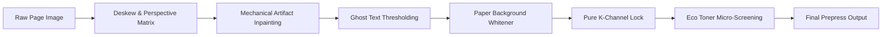

# PrintVLC — Deep Technical Architecture

This document provides a technical dive into the core algorithms, memory lifecycles, and demuxing pipelines powering PrintVLC.

---

## 1. Client-Side Demuxing Engine

PrintVLC adopts the architectural philosophy of **VLC Media Player**: handling any input stream in client-side memory without external codecs or server intermediaries.

```
                    ┌──────────────────────────────┐
                    │      File Dropped into       │
                    │   Universal Document Hopper  │
                    └──────────────┬───────────────┘
                                   │
         ┌─────────────────────────┼─────────────────────────┐
         ▼                         ▼                         ▼
  [Office & Docs]           [Raster & Scans]          [Hardware Code]
  - PDF (pdfjs-dist)        - TIFF (UTIF.js)          - ZPL (Regex + Canvas)
  - DOCX (docx-preview)     - PSD (ag-psd)            - ESC/POS (Byte parser)
  - XLSX/CSV (SheetJS)      - CAD DXF (dxf-parser)    - Prism.js (Code & MD)
         │                         │                         │
         └─────────────────────────┼─────────────────────────┘
                                   ▼
                    ┌──────────────────────────────┐
                    │ Unified Paginated Page Queue │
                    │   Array<PageItem> (High-DPI) │
                    └──────────────────────────────┘
```

### 1.1 Ingestion Specifications
- **PDF**: Employs `pdfjs-dist` to render pages directly to an offscreen high-DPI `CanvasRenderingContext2D` at 2.0x scale (150–300 DPI equivalent), caching rendered pages as compressed Object URLs.
- **DOCX**: Utilizes `docx-preview` within a detached virtual DOM container, extracting structured layout nodes, paragraphs, and styling, and rendering them onto a standard A4 canvas template.
- **Spreadsheets (XLSX, XLS, CSV, ODS)**: Uses `SheetJS` to extract active worksheets, mapping row/column tabular grids with custom column widths onto landscape preview sheets.
- **CAD (DXF)**: Evaluates 2D entity streams (`LINE`, `ARC`, `CIRCLE`, `POLYLINE`) using `dxf-parser` and renders them onto an inverted CAD blueprint dark canvas with scale transformation.
- **Hardware Byte Streams (ZPL / ESC/POS)**: Evaluates Zebra Programming Language commands (`^XA`, `^FO`, `^FD`, `^BC`, `^XZ`) into visual label canvases with simulated Code-128 barcode strips.

---

## 2. Imposition Mathematics

### 2.1 Saddle-Stitch Signature Ordering
For a document with $N$ pages:
1. Pad total pages to a multiple of 4:
   $$N_{\text{padded}} = \lceil N / 4 \rceil \times 4$$
2. For each physical sheet $s \in [0, N_{\text{padded}}/4 - 1]$:
   - **Front of Sheet**:
     $$\text{Left Page} = N_{\text{padded}} - 2s, \quad \text{Right Page} = 2s + 1$$
   - **Back of Sheet**:
     $$\text{Left Page} = 2s + 2, \quad \text{Right Page} = N_{\text{padded}} - 2s - 1$$

### 2.2 Creep Compensation (Paper Shingling)
When multiple folded sheets form a booklet, inner pages are pushed outwards along the trimmed edge. PrintVLC compensates by shifting inner pages towards the spine based on paper GSM:
$$\text{Sheet Thickness } (T) \approx \frac{\text{GSM}}{800} \text{ mm}$$
$$\Delta_{\text{creep}}(s) = (N_{\text{sheets}} - s - 1) \times T$$
Where $\Delta_{\text{creep}}$ is applied as a negative horizontal translation on inner pages and a positive translation on outer pages.

### 2.3 Poster Tiling Slicer
Given poster grid dimensions $C \times R$:
- Each cell $c \in [0, C-1], r \in [0, R-1]$ is assigned an overlap glue margin $G$ (default $10\text{ mm}$).
- Coordinate stamps are programmatically rendered at the top-left corner:
  $$\text{Stamp} = \text{"R"} + (r + 1) + \text{"-C"} + (c + 1)$$
- Alignment crosshairs (`+`) are calculated at corner tile intersections.

---

## 3. Prepress Pixel Filtering Pipeline

When rendering to the WYSIWYG canvas, pixels pass through a unified processing kernel:



1. **Pure K-Channel Black Lock**:
   Calculates luminance $L = 0.299R + 0.587G + 0.114B$. If $L < 75$, forces $R=G=B=0$ (pure black channel), preventing CMY toner usage on text.
2. **Eco Toner Saver**:
   Applies an edge-preserving micro-halftone screen: if luminance $L < 200$ and $(x + y) \pmod 3 = 0$, reduces ink deposit by adding $+55$ RGB brightness while preserving high-contrast glyph edges.
3. **Paper Background Whitener**:
   Detects scanner background noise by thresholding luminance: if $L > 255 - (\text{threshold} \times 1.2)$, forces $R=G=B=255$ (`#FFFFFF`).
4. **Ghost Text Bleed-Through Suppressor**:
   Suppresses faint reverse-side shadows within the intermediate luminance band ($180 < L < 240$) into pure background white.

---

## 4. Memory Lifecycle & Ephemeral Mode

PrintVLC enforces strict memory isolation:

- **Ephemeral RAM-Only Mode**:
  - The application registers an internal `ephemeralBlobs` set and `ephemeralWorkers` set.
  - On `window.beforeunload` or session reset, PrintVLC invokes:
    ```typescript
    ephemeralBlobs.forEach(url => URL.revokeObjectURL(url));
    ephemeralWorkers.forEach(worker => worker.terminate());
    indexedDB.deleteDatabase("PrintVLC_Storage");
    ```
  - All canvas pixel buffers are explicitly cleared (`ctx.clearRect()`) and dereferenced.
- **Local Workspace Mode**:
  - Preserves user paper dimensions, margin templates, and cached WebGPU model weights in IndexedDB (`PrintVLC_Storage`) and `CacheStorage`.

---

## 5. WebGPU On-Device AI Engine

The AI assistant utilizes `@huggingface/transformers.js` running with WebGPU shader acceleration (`navigator.gpu`):

1. **Tier 1 (SmolLM2-135M Q4 Quantized)**:
   - Processes document token sequences directly in WebAssembly/WebGPU shaders.
   - Extracts structured key takeaways and action items into a 1-page executive summary.
   - Executes regex and semantic entity matching to detect PII (SSN, credit cards, emails, phone numbers) and outputs normalized bounding coordinates.
2. **Tier 2 (Vision & Scan Enhancer)**:
   - Evaluates lighting gradient variance across the canvas surface.
   - Applies an unsharp masking convolution kernel to restore degraded text contrast.
   - Upscales low-resolution scans 2x/4x using bicubic edge-preserving interpolation.

---

## 6. Single-File Inlining Pipeline (`PrintVLC.html`)

To satisfy the zero-installation mandate without relying on electron or native wrappers, PrintVLC includes a specialized post-build inliner in `scripts/build-singlefile.mjs`:

```
dist/index.html (HTML Skeleton)
       +
dist/assets/*.css (Tailwind Industrial CSS) ──► Inlined into <style>...</style>
       +
dist/assets/*.js (React 19 + Demuxers)     ──► Inlined into <script type="module">...</script>
       ▼
PrintVLC.html (100% Standalone Single-File Web Application)
```

Developers can rebuild this standalone artifact anytime via:
```bash
npm run build:single
```
